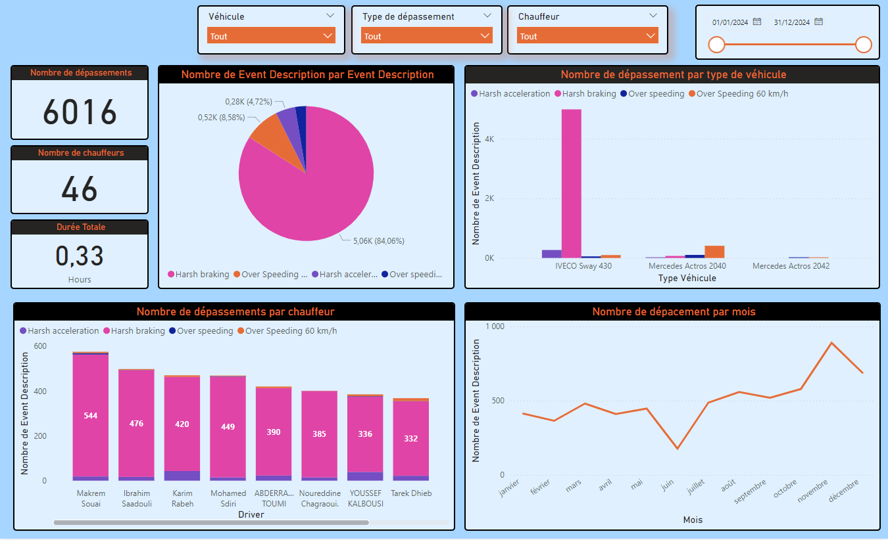

# 🚛 Logistic Quality Monitoring Dashboard 📊

## Overview
This project presents an interactive **Logistic Quality Monitoring Dashboard** designed to analyze and optimize driving behaviors in a fleet management environment. Using **Power BI**, I transformed raw event data into meaningful insights, helping logistics teams enhance safety, efficiency, and compliance.

## 🔍 Key Features
- ✅ **Event Analysis** – Tracks harsh braking, harsh acceleration, and over-speeding incidents.
- ✅ **Driver Performance** – Identifies high-risk drivers based on event occurrences.
- ✅ **Vehicle Monitoring** – Analyzes deviations by vehicle type to pinpoint patterns.
- ✅ **Time-Based Trends** – Provides monthly insights into driving behaviors.
- ✅ **Dynamic Filtering** – Enables filtering by vehicle, driver, event type, and date range.

## 📊 Dashboard Insights
The dashboard provides the following critical insights:
- **Total Number of Events** – Displays overall infractions recorded.
- **Number of Unique Drivers** – Identifies the total number of drivers involved.
- **Event Breakdown by Category** – A detailed pie chart analysis.
- **Events per Vehicle Type** – Identifies which vehicle models have the most infractions.
- **Driver Rankings** – Highlights drivers with the most violations.
- **Monthly Trends** – Tracks infractions over time for predictive analysis.

## 🛠 Tech Stack
- **Power BI** for data visualization
- **Excel/Python** for data preprocessing
- **Fleet Event Data** for logistic quality insights

## 📂 Dataset
The dataset includes event logs from logistic operations, featuring:
- Event descriptions (harsh acceleration, harsh braking, over-speeding, etc.)
- Driver identifiers and vehicle types
- Date and time of each event
- Event distribution across months

## 🚀 How This Helps
This project empowers **logistics managers** and **fleet operators** to make data-driven decisions, improve driver performance, and optimize operations. By leveraging **data analytics**, we can enhance road safety, reduce maintenance costs, and improve overall fleet efficiency.

## 📸 Dashboard Preview


## 🔗 Get Started
Clone the repository and explore the dashboard to gain valuable fleet insights:
```bash
git clone https://github.com/your-repo-name.git
```

## 📬 Contact
For any inquiries or suggestions, feel free to connect with me on **GitHub** or **LinkedIn**. Let's discuss data-driven fleet management solutions! 🚛📊
